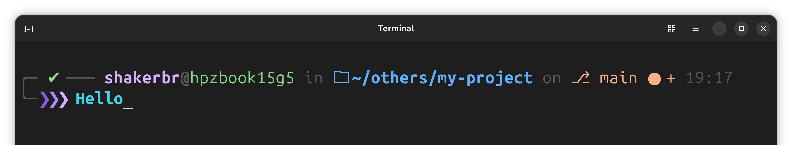
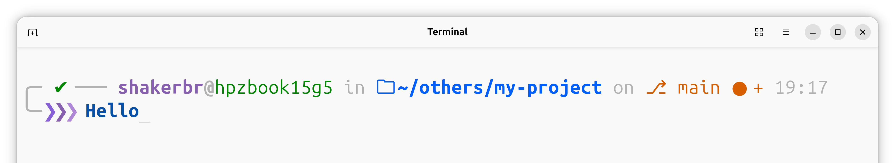

<div align="center">

# Aurora

**An adaptive, customizable Bash prompt — one file, zero dependencies.**

<br>


<br>

[](LICENSE)
[](https://www.gnu.org/software/bash/)
[](https://github.com/shakerbr/shell-prompt-style)
[](#roadmap)
[](#roadmap)

[Installation](#installation) · [Configuration](#configuration) · [Themes](#themes) · [Roadmap](#roadmap) · [License](#license)

</div>

---

Aurora is a feature-rich shell prompt built entirely in Bash. It adapts to your system's dark/light preference, surfaces git state at a glance, and exposes every detail through a single configuration block at the top of one file — no plugins, no package manager, no runtime overhead.

### Preview

<div align="center">
  <br>
  <sub><strong>Dark</strong> — aurora theme</sub>
</div>

<div align="center">
  <br>
  <sub><strong>Light</strong> — aurora theme</sub>
</div>

The live prompt auto-switches between dark and light via <code>AURORA_MODE="auto"</code>.

---

## Highlights

| | |
|---|---|
| **Themes** | Six curated palettes — Aurora, Dracula, Cyberpunk, Forest, Ocean, Mono |
| **Adaptive mode** | Auto-detect GNOME / Ptyxis dark-light, or force either mode |
| **Git-aware** | Branch, dirty/staged/untracked, ahead/behind, stash count |
| **Smart paths** | Full path, truncated parents, or basename-only display |
| **Context** | Command timer, Python venv, Conda, SSH sessions, background jobs |
| **Polish** | Six arrow styles, five connector styles, bold input, exit codes |

---

## Installation

### Prerequisites

| Dependency | Required | Notes |
|---|---|---|
| Bash 4.0+ | Yes | Standard on most Linux distributions |
| Git | No | Needed only for git prompt segments |
| `gsettings` / `dconf` | No | Needed only for `AURORA_MODE="auto"` on GNOME desktops |

### Setup

**1. Back up your existing shell config**

```bash
cp ~/.bashrc ~/.bashrc.bak
```

**2. Install Aurora** — pick one method:

<details>
<summary><strong>Recommended — clone & source</strong></summary>

```bash
git clone https://github.com/shakerbr/shell-prompt-style.git ~/.config/aurora-prompt
echo 'source ~/.config/aurora-prompt/bashrc' >> ~/.bashrc
```

</details>

<details>
<summary><strong>Quick — download a single file</strong></summary>

```bash
curl -fsSL https://raw.githubusercontent.com/shakerbr/shell-prompt-style/main/bashrc \
  -o ~/.aurora-prompt.sh
echo 'source ~/.aurora-prompt.sh' >> ~/.bashrc
```

</details>

<details>
<summary><strong>Manual — copy into <code>~/.bashrc</code></strong></summary>

Open [`bashrc`](bashrc), copy the full contents, and paste them at the end of your `~/.bashrc`.

</details>

**3. Reload your shell**

```bash
source ~/.bashrc
```

---

## Configuration

All settings live in the **CONFIGURATION** block at the top of [`bashrc`](bashrc). Everything below the engine divider is implementation — no edits needed there.

### Appearance

| Variable | Default | Options |
|---|---|---|
| `AURORA_THEME` | `aurora` | `aurora` · `dracula` · `cyberpunk` · `forest` · `ocean` · `mono` |
| `AURORA_MODE` | `auto` | `auto` · `dark` · `light` |
| `AURORA_ARROW_STYLE` | `chevron` | `chevron` · `arrow` · `lambda` · `dollar` · `rocket` · `minimal` |
| `AURORA_CONNECTOR_STYLE` | `rounded` | `rounded` · `sharp` · `dots` · `dashes` · `none` |
| `AURORA_BOLD_INPUT` | `true` | Bold typed commands |
| `AURORA_INPUT_COLOR` | `""` | `dark:light` 256-color pair (e.g. `183:27`); both required or input color stays default |

### Display

| Variable | Default | Description |
|---|---|---|
| `AURORA_SHOW_USER` | `true` | Username |
| `AURORA_SHOW_HOST` | `true` | Hostname |
| `AURORA_SHOW_TIME` | `true` | Clock in prompt |
| `AURORA_TIME_FORMAT` | `24h` | `24h` or `12h` |
| `AURORA_DIR_STYLE` | `full` | `full` · `truncate` · `basename` |
| `AURORA_SHOW_SSH` | `true` | Highlight remote SSH sessions |
| `AURORA_SHOW_JOBS` | `true` | Background job count |
| `AURORA_SHOW_VENV` | `true` | Active Python venv or Conda env |

### Git & timing

| Variable | Default | Description |
|---|---|---|
| `AURORA_SHOW_GIT` | `true` | Branch and working-tree status |
| `AURORA_SHOW_GIT_STASH` | `true` | Stash count |
| `AURORA_SHOW_GIT_UPSTREAM` | `true` | Ahead / behind upstream |
| `AURORA_SHOW_TIMER` | `true` | Last command duration |
| `AURORA_TIMER_THRESHOLD` | `3` | Seconds before timer appears |
| `AURORA_SHOW_EXIT_CODE` | `true` | Numeric code on failure |

### Recipe — minimal Dracula

```bash
AURORA_THEME="dracula"
AURORA_MODE="dark"
AURORA_SHOW_HOST=false
AURORA_SHOW_TIME=false
AURORA_ARROW_STYLE="lambda"
AURORA_CONNECTOR_STYLE="none"
```

### Recipe — terminals without Nerd Font

Replace unicode symbols with plain text:

```bash
AURORA_SYM_FOLDER=""
AURORA_SYM_GIT="git:"
AURORA_SYM_SUCCESS="ok"
AURORA_SYM_FAIL="err"
```

---

## Themes

| Theme | Character |
|---|---|
| `aurora` | Soft purples and greens — the default |
| `dracula` | Classic Dracula-inspired contrast |
| `cyberpunk` | Neon pink and cyan |
| `forest` | Earthy greens |
| `ocean` | Cool blues and teals |
| `mono` | Grayscale, distraction-free |

Each theme ships with tuned palettes for both dark and light terminal backgrounds.

---

## Project layout

```
shell-prompt-style/
├── bashrc                  # Config + engine — the entire prompt
├── docs/
│   ├── availability.svg      # Platform & shell roadmap graphic
│   ├── preview-dark.png        # README preview (dark, cropped)
│   ├── preview-light.png       # README preview (light, cropped)
│   ├── preview-dark-full.png   # Full terminal screenshot (source)
│   └── preview-light-full.png  # Full terminal screenshot (source)
├── LICENSE                 # MIT
└── README.md
```

---

## Roadmap

Aurora v1.0 targets **Bash on Linux**. Planned next:

| Area | Status |
|---|---|
| **Linux** | Available now — auto dark/light via GNOME / Ptyxis |
| **Other Linux distros** | Broader desktop-environment detection (KDE, XFCE, etc.) |
| **macOS** | Terminal theme detection + install path for `.bash_profile` |
| **Windows** | Git Bash, WSL, and native terminal support |
| **Other shells** | Zsh, Fish, and others — same look, shell-native implementation |

Want a specific platform or shell prioritized? [Open an issue](https://github.com/shakerbr/shell-prompt-style/issues) and let us know.

---

## Uninstall

Remove the `source` line (or pasted block) from `~/.bashrc`, then reload:

```bash
source ~/.bashrc
```

Your backup at `~/.bashrc.bak` is left untouched.

---

## Contributing

Found a bug or have an idea? [Open an issue](https://github.com/shakerbr/shell-prompt-style/issues) or submit a pull request — all contributions are welcome.

---

## License

Released under the [MIT License](LICENSE).

Copyright © 2026 [Shaker Br](https://github.com/shakerbr) · [shbhky@gmail.com](mailto:shbhky@gmail.com)
